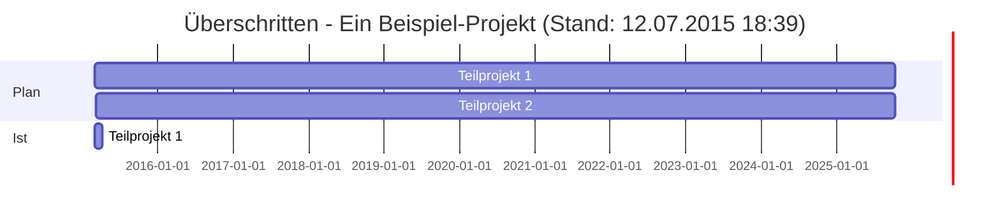

# Checklist: Überschritten - Ein Beispiel-Projekt (Stand: 12.07.2015 18:39)

- [WARNING] - [Teilprojekt 1](yaio:SysPlay119) 62% (12.0h/25.0h)
- [LATE] - [Teilprojekt 2](yaio:SysPlay123) 0% (/10.0h)

# Gantt: Überschritten - Ein Beispiel-Projekt (Stand: 12.07.2015 18:39)

